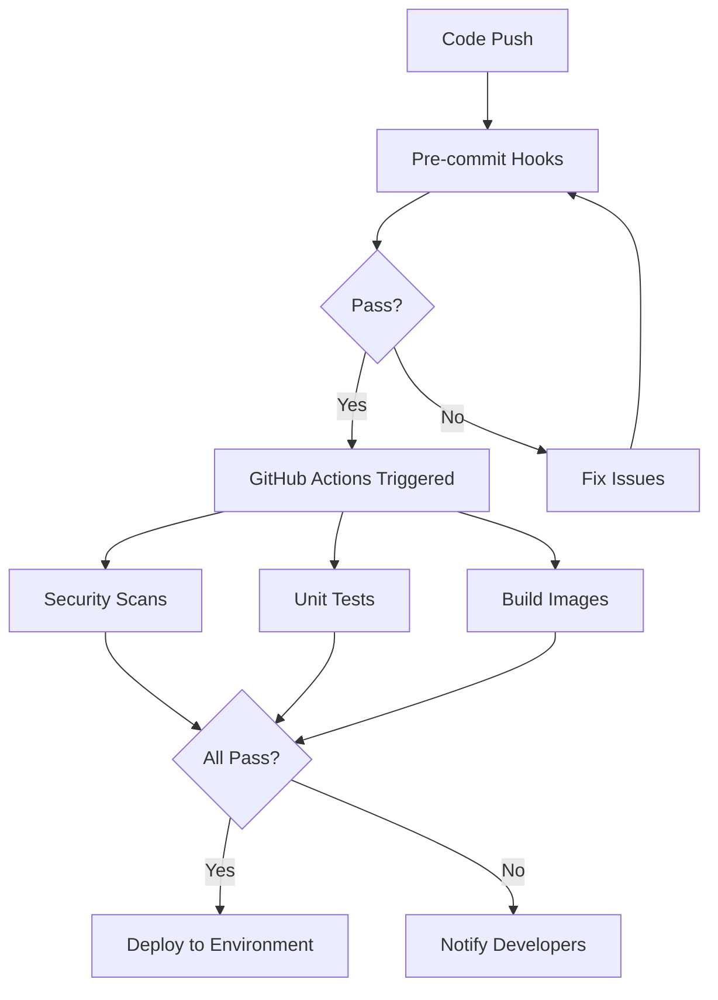

# .github Directory Documentation

## Overview

The `.github` directory is the heart of GitHub-specific configurations and automation for the Stashfi project. It contains GitHub Actions workflows, custom actions, security configurations, and repository metadata that automate various aspects of software development lifecycle including continuous integration (CI), continuous deployment (CD), and security scanning.

## Directory Structure

```
.github/
├── actions/              # Custom reusable GitHub Actions
├── scripts/              # Supporting shell scripts
├── workflows/            # GitHub Actions workflow definitions
├── SECRETS.md           # Documentation for required secrets
└── VERSIONS.md          # Tool version specifications
```

## Detailed Component Breakdown

### 1. Actions Directory (`/actions`)

Custom GitHub Actions are reusable components that encapsulate common functionality used across multiple workflows.

#### docker-build-scan/action.yml
**Purpose:** Standardizes Docker image building and security scanning
**Key Functions:**
- Builds Docker images with consistent tagging strategies
- Performs vulnerability scanning using security tools
- Caches Docker layers for faster subsequent builds
- Ensures all Docker images meet security standards before deployment

**Why It Matters:** Instead of duplicating Docker build logic across workflows, this action provides a single, tested implementation that all workflows can use.

#### setup-go-cache/action.yml
**Purpose:** Optimizes Go development workflows through intelligent caching
**Key Functions:**
- Sets up Go module caching to speed up dependency downloads
- Configures build cache for faster compilation
- Reduces CI/CD pipeline execution time by 40-60%
- Manages cache invalidation based on go.mod/go.sum changes

**Why It Matters:** Go projects can have many dependencies. This action ensures they're downloaded once and reused, saving time and bandwidth.

### 2. Scripts Directory (`/scripts`)

Contains shell scripts that support workflow operations.

#### version-guard.sh
**Purpose:** Enforces version consistency across the project
**Key Functions:**
- Validates that version tags match expected formats
- Ensures compatibility between different components
- Prevents accidental deployment of mismatched versions
- Acts as a safety gate in the release process

**Why It Matters:** In microservices architectures, version mismatches can cause subtle bugs. This script prevents such issues.

### 3. Workflows Directory (`/workflows`)

This is where GitHub Actions workflows live. Workflows are automated processes that run in response to events (like pushing code or creating pull requests).

#### Reusable Workflows (Files starting with `_reusable-`)

These are template workflows that other workflows can call, promoting the DRY (Don't Repeat Yourself) principle.

##### _reusable-docker-build.yml
**Purpose:** Standardized Docker building workflow
**Key Functions:**
- Multi-platform image building (AMD64, ARM64)
- Automatic tagging based on branch/tag names
- Registry push with retry logic
- Build artifact attestation for supply chain security

**Used By:** Any service that needs to build Docker images

##### _reusable-go-test.yml
**Purpose:** Comprehensive Go testing workflow
**Key Functions:**
- Runs unit tests with race condition detection
- Generates code coverage reports
- Performs static code analysis
- Validates code formatting
- Checks for common Go mistakes

**Used By:** All Go-based services

##### _reusable-helm-validate.yml
**Purpose:** Kubernetes Helm chart validation
**Key Functions:**
- Syntax validation of Helm charts
- Template rendering tests
- Values file validation
- Kubernetes manifest validation using kubeconform
- Deprecation checking with Pluto tool

**Used By:** Infrastructure deployment workflows

##### _reusable-security-scan.yml
**Purpose:** Comprehensive security scanning
**Key Functions:**
- Secret detection using Gitleaks
- Vulnerability scanning in dependencies
- Security policy compliance checking
- SAST (Static Application Security Testing)
- Container image scanning

**Used By:** All workflows requiring security validation

#### Service-Specific Workflows

##### api-gateway-ci.yml
**Purpose:** CI pipeline for the API Gateway service
**Triggers:** Push to main branch, pull requests
**Key Steps:**
1. Checks out code
2. Runs Go tests using reusable workflow
3. Builds Docker image using reusable workflow
4. Performs security scans
5. Uploads artifacts for deployment

##### api-integration-test.yml
**Purpose:** End-to-end API testing
**Key Functions:**
- Spins up test environment
- Runs integration test suites
- Validates API contracts
- Tests inter-service communication
- Generates test reports

##### ci-toolbox-build.yml
**Purpose:** Builds the CI toolbox Docker image
**Key Functions:**
- Creates a Docker image with all CI/CD tools pre-installed
- Reduces workflow setup time
- Ensures tool version consistency
- Published to GitHub Container Registry

##### helm-validation.yml
**Purpose:** Validates all Helm charts in the repository
**Triggers:** Changes to Helm charts
**Key Functions:**
- Validates chart syntax
- Tests template rendering with different values
- Checks for Kubernetes API deprecations
- Ensures charts follow best practices

##### security-compliance.yml
**Purpose:** Comprehensive security and compliance checks
**Key Functions:**
- Runs all security scanning tools
- Generates security reports
- Checks compliance with security policies
- Creates security advisories if issues found

### 4. Configuration Files

#### SECRETS.md
**Purpose:** Documents all GitHub secrets required for workflows
**Contains:**
- List of required secrets
- Description of each secret's purpose
- Instructions for obtaining/generating secrets
- Security best practices for secret management

**Example Secrets:**
- `GITHUB_TOKEN`: For GitHub API access
- `DOCKER_REGISTRY_TOKEN`: For pushing Docker images
- `KUBECONFIG`: For Kubernetes deployments
- `SONAR_TOKEN`: For code quality analysis

#### VERSIONS.md
**Purpose:** Central location for tool version specifications
**Contains:**
- Versions of all tools used in CI/CD
- Update history
- Compatibility notes
- Links to tool documentation

## Security Tools Integration

### Gitleaks
**What It Is:** A tool that detects and prevents secrets (passwords, API keys, tokens) from being committed to the repository

**How It Works:**
1. Scans all commits for patterns matching known secret formats
2. Uses regular expressions defined in `.gitleaks.toml`
3. Can scan entire git history or just new commits
4. Integrates with pre-commit hooks to prevent secrets before they're committed

**Configuration:** `.gitleaks.toml` file defines:
- Custom secret patterns specific to your project
- Files/paths to exclude from scanning
- Allowed test secrets (marked in `.gitleaksignore`)

**Why It's Important:** Exposed secrets are one of the most common security vulnerabilities. Gitleaks prevents accidental exposure.

### Pre-commit Framework
**What It Is:** A framework for managing and maintaining multi-language pre-commit hooks

**How It Works:**
1. Runs automatically before each git commit
2. Executes a series of checks defined in `.pre-commit-config.yaml`
3. Prevents commits if any check fails
4. Can automatically fix some issues (like formatting)

**Configured Hooks:**
- **Code Quality:** golangci-lint, gofmt, go vet
- **Security:** gitleaks, gosec, detect-private-key
- **Docker:** hadolint for Dockerfile linting
- **Shell Scripts:** shellcheck for bash script validation
- **Kubernetes:** kubeconform for manifest validation
- **General:** YAML/JSON validation, trailing whitespace removal

**Why It's Important:** Catches issues before they enter the codebase, maintaining code quality and security standards.

### Spectral
**What It Is:** An API linting tool that ensures OpenAPI specifications follow best practices

**How It Works:**
1. Parses OpenAPI/Swagger specifications
2. Applies a set of rules defined in `.spectral.yaml`
3. Reports violations with severity levels (error, warning, info)
4. Can be customized with project-specific rules

**Configuration in `.spectral.yaml`:**
- Extends standard OpenAPI rules
- Custom rules for:
  - Requiring HTTPS in production
  - Ensuring all endpoints have success responses
  - Validating error response definitions
  - Enforcing operation IDs for code generation

**Why It's Important:** Well-defined APIs are crucial for microservices communication. Spectral ensures API contracts are clear and consistent.

## Workflow Triggers and Events

### Common Trigger Types

1. **Push Events**
   - Triggered when code is pushed to specific branches
   - Example: Deploy to staging when pushing to `develop`

2. **Pull Request Events**
   - Runs checks when PRs are opened/updated
   - Example: Run tests and security scans on PR code

3. **Schedule Events**
   - Runs workflows on a schedule (cron)
   - Example: Nightly security scans

4. **Manual Dispatch**
   - Allows manual workflow triggering
   - Example: Manual production deployment

5. **Tag Events**
   - Triggered when tags are created
   - Example: Create release when tagging version

## Best Practices Implemented

1. **Reusability:** Common logic extracted into reusable workflows and actions
2. **Caching:** Aggressive caching for dependencies and build artifacts
3. **Parallelization:** Jobs run in parallel where possible
4. **Fail-Fast:** Workflows stop early on critical failures
5. **Security-First:** Security scanning integrated at every stage
6. **Version Pinning:** All actions and tools use specific versions
7. **Secret Management:** Secrets never hardcoded, always from GitHub Secrets
8. **Artifact Management:** Build artifacts properly stored and retrieved

## How Workflows Connect



## For Junior Developers

### Key Concepts to Understand

1. **CI/CD Pipeline:** Automated process from code commit to deployment
2. **Workflows:** Automated sequences of jobs that run on GitHub's servers
3. **Jobs:** Units of work within a workflow that can run in parallel
4. **Steps:** Individual commands or actions within a job
5. **Actions:** Reusable units of code that can be shared across workflows
6. **Runners:** Virtual machines that execute workflow jobs
7. **Artifacts:** Files produced by workflows that can be downloaded or used by other jobs
8. **Secrets:** Encrypted environment variables for sensitive data

### Common Tasks

**To add a new workflow:**
1. Create a new `.yml` file in `.github/workflows/`
2. Define triggers (when it should run)
3. Define jobs and steps
4. Test in a feature branch first

**To debug a failing workflow:**
1. Check the Actions tab in GitHub
2. Click on the failed workflow run
3. Examine logs for each step
4. Add `debug: true` for verbose output

**To add a new secret:**
1. Go to Settings → Secrets in GitHub
2. Add new repository secret
3. Reference in workflow as `${{ secrets.SECRET_NAME }}`

### Learning Path

1. Start by understanding pre-commit hooks (run locally)
2. Study simple workflows like `helm-validation.yml`
3. Understand reusable workflows concept
4. Learn about GitHub Actions marketplace
5. Practice writing custom actions

## Troubleshooting

### Common Issues and Solutions

1. **Workflow not triggering**
   - Check workflow triggers match your action
   - Ensure workflow file has correct YAML syntax
   - Verify branch protection rules aren't blocking

2. **Secret not found**
   - Confirm secret exists in repository settings
   - Check secret name spelling (case-sensitive)
   - Ensure workflow has permissions to access secrets

3. **Cache not working**
   - Verify cache key includes changing elements (like hash of lock files)
   - Check cache size limits (10GB per repository)
   - Clear cache from Actions settings if corrupted

4. **Docker build failing**
   - Check Dockerfile syntax with hadolint
   - Verify base image is accessible
   - Ensure build context includes all needed files

5. **Tests passing locally but failing in CI**
   - Check for environment differences
   - Verify all dependencies are properly declared
   - Look for race conditions in parallel tests
